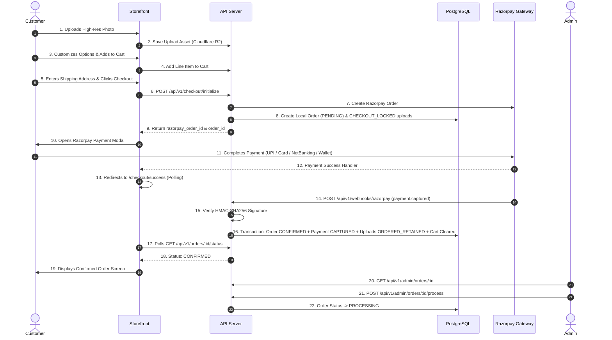

# Project State: WePrintIt

> **Milestone Status**: Checkout & Payment Pipeline Complete  
> **Date**: August 16, 2026  
> **Platform**: WePrintIt / First Memoir — Custom Photo Printing Platform

---

## 1. Executive Summary

WePrintIt is a production-ready, full-stack custom photo printing platform. The core customer purchase lifecycle, payment capture, webhook idempotency, upload retention management, and admin order fulfillment review pipelines have been completed and verified end-to-end.

---

## 2. Completed Features

### Frontend (Storefront & Admin)
- **Product Catalog**: Dynamic catalog browsing, category filters, responsive grid layout.
- **Product Details & Customization Flow**:
  - Interactive multi-axis image upload (Client-side DPI calculations, aspect-ratio lock, orientation toggles).
  - Direct multipart image upload to Cloudflare R2 with instant client preview generation.
  - Dynamic option variant selector (size, paper finish, frames) with real-time price modifier computation.
  - Print quality indicators (`EXCELLENT`, `GOOD`, `LOW_QUALITY`) and explicit low-DPI user acknowledgment gate.
- **Shopping Cart**:
  - Session-bound and user-authenticated persistent cart line items.
  - Snapshot validation, image crop geometry preservation, and authoritative server-side price calculation.
- **Checkout**:
  - Delivery address capture with strict validation.
  - Razorpay JS Checkout integration with seamless modal dismissal and retry handling.
  - Idempotent double-click protection against duplicate orders.
- **Success & Order Confirmation**:
  - Live order status polling page (`/checkout/success?order_id=...`).
  - Graceful transition to confirmed state as soon as authoritative webhook confirms payment.

### Backend (Express API & Shared Packages)
- **Authentication**: JWT-based authentication for customers and admins with role-based access control.
- **Product & Category Management**: Full CRUD APIs with SKU support, active toggles, and relational category binding.
- **Cart Pipeline**: Authoritative server-side pricing recalculation, stale cart item handling, and session linkage.
- **Checkout Engine**:
  - Atomic database transactions with row-level locks (`SELECT FOR UPDATE`).
  - Razorpay Order initialization with server-calculated amounts in paise.
  - Stale/paid Razorpay order detection: automatically expires abandoned orders and creates fresh Razorpay orders on retry.
- **Payment & Webhook Engine**:
  - Cryptographic HMAC-SHA256 signature verification on `/api/v1/webhooks/razorpay`.
  - Idempotent event ledger (`WebhookEvent`) preventing replay attacks or duplicate processing.
  - Atomic post-payment transaction: transitions `Order` (`PENDING` → `CONFIRMED`), logs `Payment` (`CAPTURED`), locks `UserUpload` assets (`ORDERED_RETAINED`), and clears purchased items from the active cart.
- **Admin Orders & Fulfillment Management**:
  - Orders listing with multi-status filtering (`PENDING`, `CONFIRMED`, `PROCESSING`, `SHIPPED`, `DELIVERED`, `CANCELLED`).
  - Detailed order view showing customer contact, shipping address, payment transaction IDs, line items, physical dimensions, and master high-res upload assets.
  - Order state transition (`CONFIRMED` → `PROCESSING`).

---

## 3. Verified End-to-End Flow

---

## 4. Current Database State & Schema Entities

| Entity | Purpose | Key Fields / Invariants |
| :--- | :--- | :--- |
| **`Product`** | Catalog print products | `id`, `name`, `slug`, `sku`, `base_price`, `is_active`, `category_id` |
| **`ProductOption` / `Value`** | Customization attributes | Size, Paper Finish, Frame variants with `price_modifier` and physical dimensions |
| **`UserUpload`** | High-res customer images | `r2_key`, `preview_r2_key`, `retention_status` (`CART_ATTACHED` → `CHECKOUT_LOCKED` → `ORDERED_RETAINED`) |
| **`Cart` & `CartLineItem`** | Active shopping baskets | `session_id`, `user_id`, `quantity`, `crop_x`, `crop_y`, `effective_dpi`, `dpi_acknowledged` |
| **`Order`** | Authoritative order records | `status` (`PENDING`, `CONFIRMED`, `PROCESSING`, `SHIPPED`, `DELIVERED`, `CANCELLED`), `total_amount`, `shipping_address_snapshot` |
| **`OrderItem`** | Snapshot of purchased items | `product_id`, `upload_id`, `unit_price`, `customization_data` (immutable pricing & dimension snapshot) |
| **`Payment`** | Ledger of financial captures | `order_id`, `razorpay_payment_id` (Unique), `status` (`CAPTURED`), `amount` |
| **`WebhookEvent`** | Idempotent webhook log | `event_id` (Unique), `provider` (`razorpay` / `shiprocket`), `processing_status` (`PROCESSED`) |

---

## 5. Known Deferred Items (Shiprocket & Courier Boundaries)

> [!IMPORTANT]
> Shiprocket automated fulfillment is intentionally parked behind the safety guard `PACKAGE_FULFILLMENT_METRICS_UNDEFINED`.

### Client Business Rules Needed Before Resuming Fulfillment:
1. **Courier Packaging Type**: Box, tube, flat mailer, or bubble wrap specs per product category.
2. **Dead Weight & Slabs**: Exact tare weights of frames, canvas stretcher bars, paper weights, and tare packaging weight.
3. **Volumetric Dimensions**: Master packaged dimensions $(L \times W \times H)$ calculated per combination of frame sizes and quantities.
4. **Pickup Location Code**: Authoritative Shiprocket warehouse pickup location nickname.
5. **R2 Asset Retention Policy**: Automated archival or deletion timeline for high-res master files after successful printing/delivery.
6. **Customer Notifications**: Selection and credentials for transactional SMS/WhatsApp/Email providers (e.g., Twilio, SendGrid, Gupshup).

---

## 6. Next Development Phase

1. **Manufacturing / Lab Queue Workflow**: Admin print queue with high-res asset download bundles for lab operators.
2. **Customer Account Portal**: Customer order history, tracking links, and reorder functionality.
3. **Transactional Notifications**: Automated email/WhatsApp notifications upon payment capture and order dispatch.
4. **Shiprocket Shipping Engine**: Implementation of courier dimension calculators and live AWB generation once business rules are finalized.
5. **Production Cloud Deployment**: Production containerization, CDN routing, and PostgreSQL migration deployment to Neon.

---

## 7. Customer Resilience & Operational Observability Milestone
Completed phase focused on architecture safety and operational monitoring.
See `docs/phases/customer_resilience_and_observability_completion.md` for full implementation details, proxy configuration logic, storefront boundary additions, and webhook protection rationale.

## 8. Integration Test Infrastructure Recovery Milestone
Automated testing environment restored with strict Docker orchestration, isolated Prisma schema migration targeting, and 109 verified tests to ensure webhook and checkout pipeline resilience.
